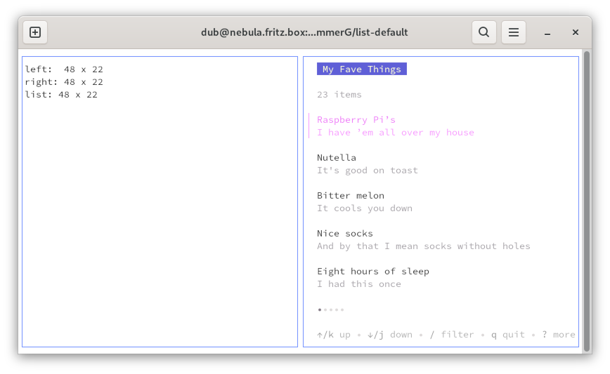
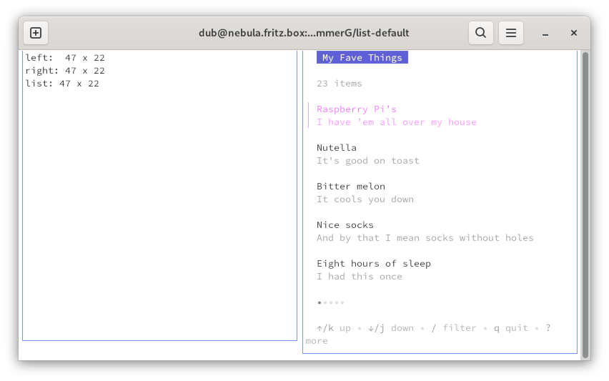
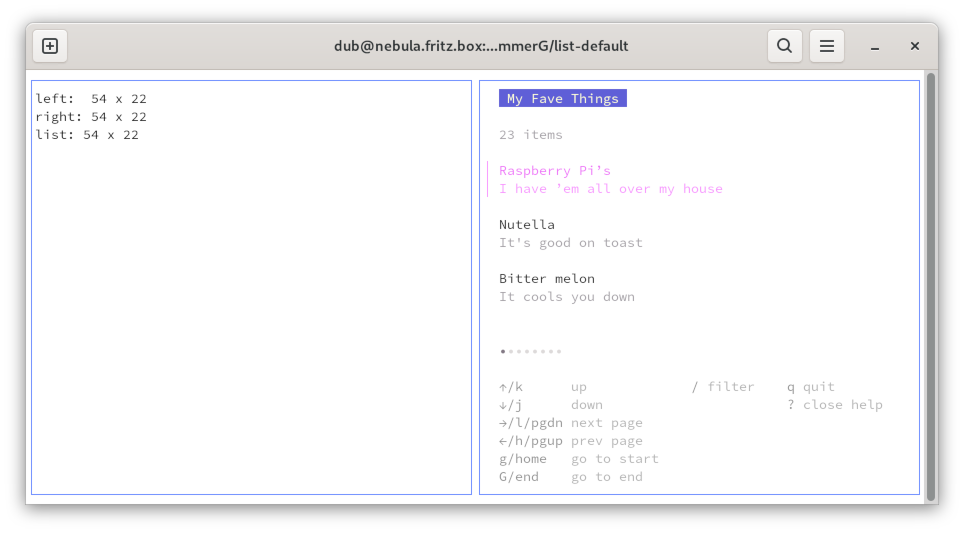
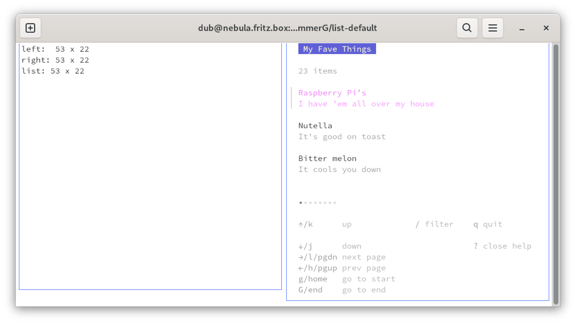
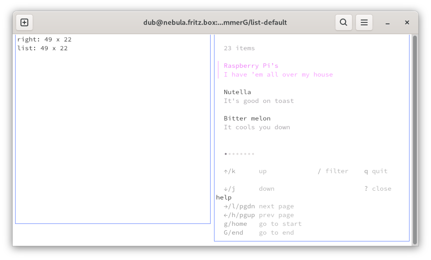
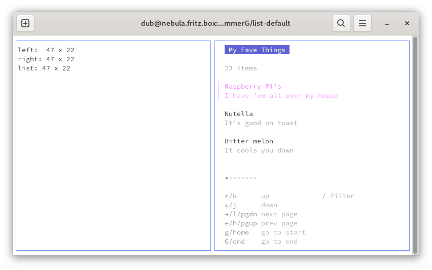

# Default List

I copied this from [bubbletea/examples/list-default](https://github.com/charmbracelet/bubbletea/tree/master/examples/list-default)
and modified it to show 2 windows.

While playing with it I noticed that the help text ist rendered incorrectly, when the window gets to small to put everything on one line.

Further reducing the width of the window makes the help widget to show an ellipsis and the rendering looks good again.

## Full Help ##

something similar happens with full help activated.

everything is ok when the window is wide enough.

but again things look odd when the window gets smaller.
this could be related to [Help bubble has an unwanted right padding #415](https://github.com/charmbracelet/bubbles/issues/415)

when the window gets even smaller then we can see word wrapping.

in full help we don't see ellipsis. instead the full column is dropped - which makes sense.
